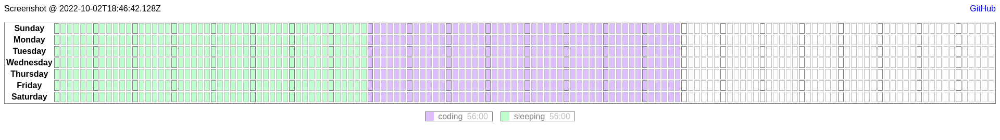

# Week Planner

This repository hosts a simple web application for graphical week planning.
The application runs directly off an HTML file and has no backend.
Persistence is taken care of using the local storage API.

## Warning

There is no local or cloud backup.
The application is rudimentary, for personal use and non-serious at that.

## Running

To run the application, open the path of the `index.html` file in your browser.
You might need to configure your browser to allow CORS on the `file:` protocol.

## Features

Lays out a single week with 10-minute slots each of which can be assigned a
different color.

Allows for creation of custom activities using the `+` button.
Activities have a name and color.

Allows dragging across multiple slots to draw in the activity color in bulk.

Allows removing activities (using the `-` button).
Slots associated with the given activity will remain associated with it until
painted something else.

Allows renaming and recoloring activities (by clicking on the activity name when
it is already selected).
Slots associated with the given activity will retain the original color until
repainted.

## Roadmap

There are no updates planned.
I made it because I wanted to visualize a particular week as a one-off.
I might improve it if I need to use it again.
The improvements I have in mind are kept in this readme.

## To-Do

- [ ] Implement import and export functionality

  Collect the local storage into a JSON file and download it to backup.

- [ ] Host on Deno Deploy as a fully- or semi-static website

  To make available online, host on Deno Deploy.
  Perhaps add a HTTP Basic auth and come up with a little backend, too.
  Use Supabase for persistence of data.

- [ ] Build a better create/update activity experience using `dialog`

  Use the `dialog` HTML element to provide a new UI to create/edit activity.
  Enforce unique names and use those to associate the slots and the activities.
  Provide a nice pastel color paletter instead of the browser-native selector.

- [ ] Remove the `:has` refresh Firefox hack once no longer needed

  I am using `:has` which is an experimental feature in Firefox at the moment.
  It is enabled via the `tlayout.css.has-selector.enabled` `about:config` flag.
  Currently there is a bug with `:has(:checked)` where if the `label` is clicked
  and the `input` becomes `:checked` the selector doesn't reflect that.
